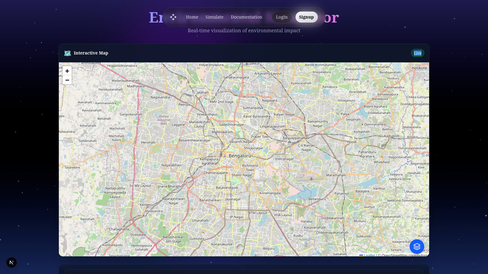
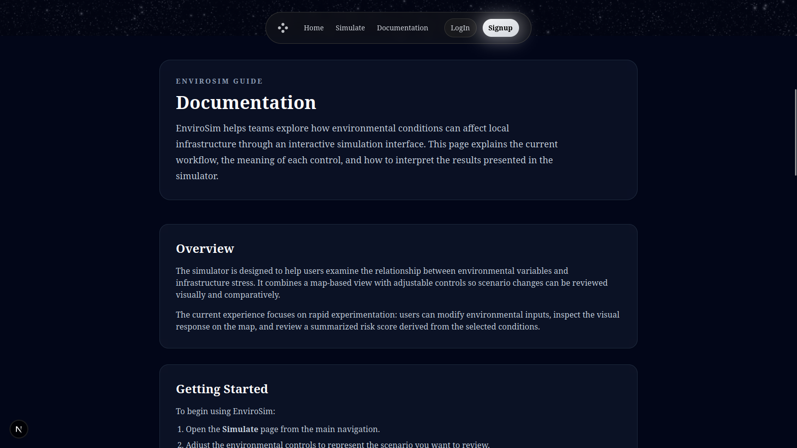

# EnviroSim

EnviroSim is an environmental simulation project that helps visualize how changing environmental conditions can affect local infrastructure. The repository currently includes a `Next.js` frontend, an `Express` backend, and a `Data` workspace for datasets, processed outputs, and future ML model work.

## Overview

The project is organized around three main parts:

- `Frontend` contains the user interface built with `Next.js`, `React`, and Tailwind-based styling.
- `Backend` contains a lightweight `Express` API with a `/simulate` route used by the frontend.
- `Data` contains datasets, cleaned data, generated outputs, and placeholder Python model files for future ML integration.

## Project Structure

```text
EnviroSim/
├── Frontend/        # Next.js application
├── Backend/         # Express backend API
├── Data/
│   ├── Dataset/     # Raw datasets
│   ├── cleaned-data/# Processed datasets
│   ├── outputs/     # Generated outputs
│   └── Models/      # Placeholder Python model files
└── README.md
```

## Tech Stack

- Frontend: `Next.js`, `React`, `Tailwind CSS`
- Backend: `Node.js`, `Express`, `CORS`
- Data/ML workspace: `Python` model files and dataset folders for future integration

## Prerequisites

Install these before running the project:

- `Node.js` and `npm`
- `Python 3` if you plan to expand the ML/data side of the project

## How To Run The Project

### 1. Frontend Setup

Move into the frontend folder:

```bash
cd Frontend
```

Install dependencies:

```bash
npm install
```

Start the development server:

```bash
npm run dev
```

The frontend runs on:

```text
http://localhost:3000
```

### 2. Backend Setup

Open a new terminal and move into the backend folder:

```bash
cd Backend
```

Install dependencies:

```bash
npm install
```

Start the backend server:

```bash
node index.js
```

The backend runs on:

```text
http://localhost:6969
```

### 3. ML / Python Setup

The repository currently contains Python model files inside `Data/Models`, but it does **not** currently include an `Ml` folder, `requirements.txt`, or `app.py` entrypoint in the tracked project structure.

If you add an ML service later, you can document it here in this format:

```bash
cd Ml
pip install -r requirements.txt
python app.py
```

## Current Workflow

1. Start the backend server from `Backend`.
2. Start the frontend server from `Frontend`.
3. Open the frontend in your browser.
4. Use the simulator interface to adjust environmental values such as temperature, pollution, rainfall, and wind speed.

## Key Features

- Interactive landing page and simulator UI
- Environmental control sliders for scenario testing
- Map-based visualization components
- Backend simulation endpoint at `/simulate`
- Data directories prepared for future ML and risk-model expansion

## API Note

The frontend is configured to call:

```text
POST http://localhost:6969/simulate
```

Make sure the backend is running before using simulation features in the frontend.

## Screenshots

### Landing Page


### Simulation Dashboard



### Documentation Page



## Data And ML Notes

- `Data/Dataset` stores raw datasets.
- `Data/cleaned-data` stores processed datasets.
- `Data/outputs` stores generated result files.
- `Data/Models` is available for future Python model development.

At the moment, the ML side looks like a workspace-in-progress rather than a runnable standalone service.

## Contributing

If you are working with teammates:

1. Pull the latest changes.
2. Install dependencies inside the relevant folder.
3. Run the frontend and backend locally.
4. Keep README instructions updated whenever setup steps change.

## License

No license file is currently included in this repository. Add one if you plan to distribute or open-source the project.
